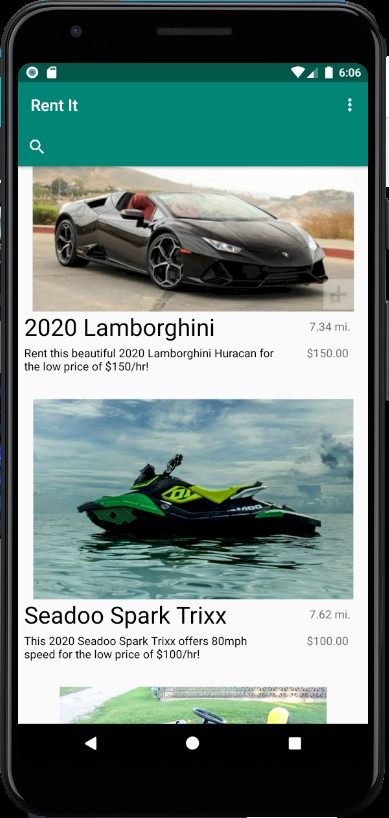

# RentIT
Large mobile application that lets users rent and rent out items and tools to other users based on geo-location. This app was developed with a team of 5 peers using the Agile methodology.

